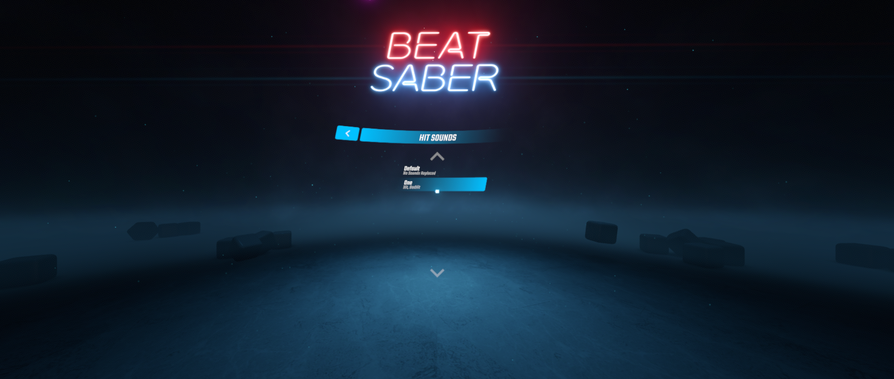
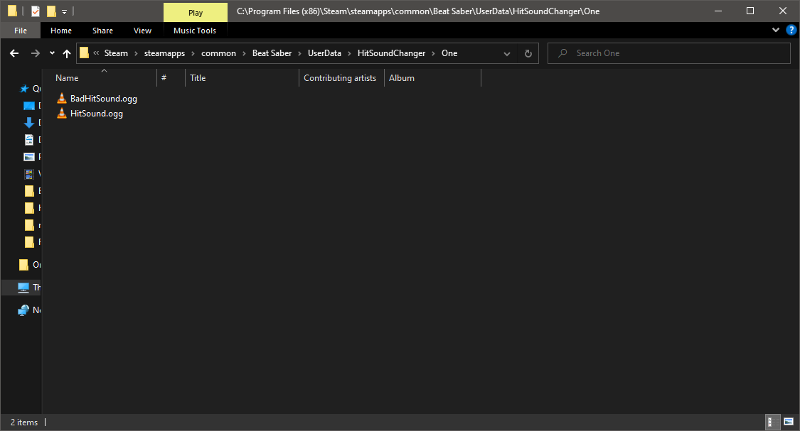

# HitSoundChanger
This is an updated and cleaned up fork of [Kylemc1413 HitSoundChanger](https://github.com/Kylemc1413/HitSoundChanger). As the name suggests, it is a BSIPA compatible mod that changes block hit sounds. 

## Installation
Make sure that you have core mods installed with [ModAssistant](https://github.com/Assistant/ModAssistant) (BSIPA, BS Utils, BSML). Then place HitSoundChanger.dll into Plugins directory in the game folder.

## Usage
First, you will need to find hitsounds that you want to use and create a config. Please note that the hit sounds should have certain offset, otherwise it might seem like the sound is playied before you even hit the block. To download ready to use hit sounds, check out [BSMG discord's](https://discord.gg/beatsabermods) #game-sounds section.

Once you have hit sounds you want to use, name them HitSound.ogg and BadHitSound.ogg (make sure you have file extensions visible otherwise you might actually name it HitSound.ogg.ogg). Create a new folder in Beat Saber install directory -> UserData -> HitSoundChanger (should be created automatically if you run the game with mod once) and put those files into this folder. After you have done then, (re)start the game and choose which hitsounds you want to use in the in-game menu. If you are unsure how the folder structure should look, check out the screenshot bellow.

## Download
You can always download the latest release from the [releases page](https://github.com/SamuelTulach/HitSoundChanger/releases).

## Issues/constributing
If you find any issue or you have a suggestion, you can use GitHub issues. If you want to contribute, this repo is accepting pull requests.